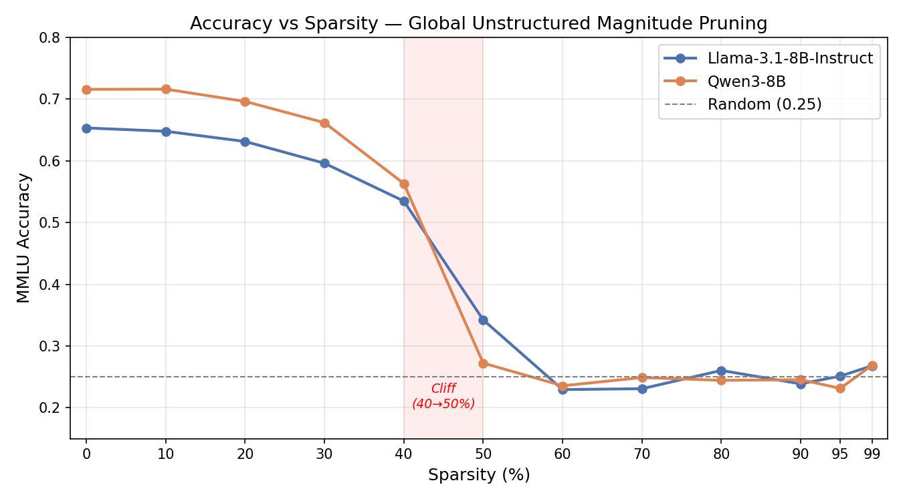
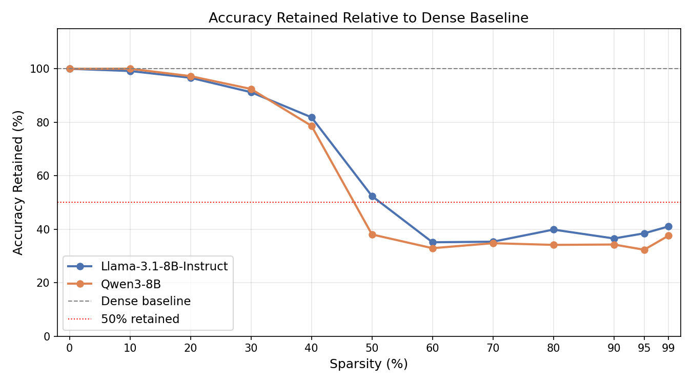
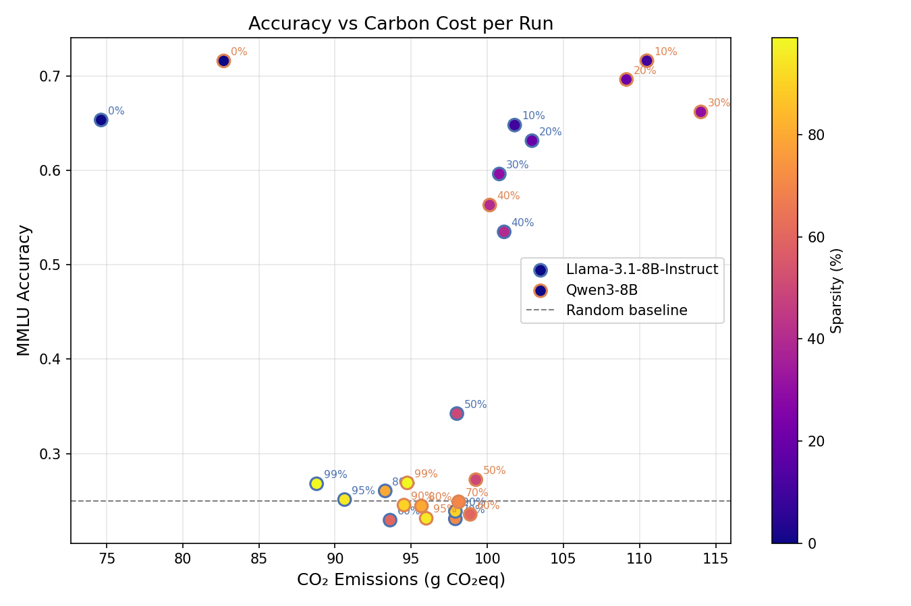
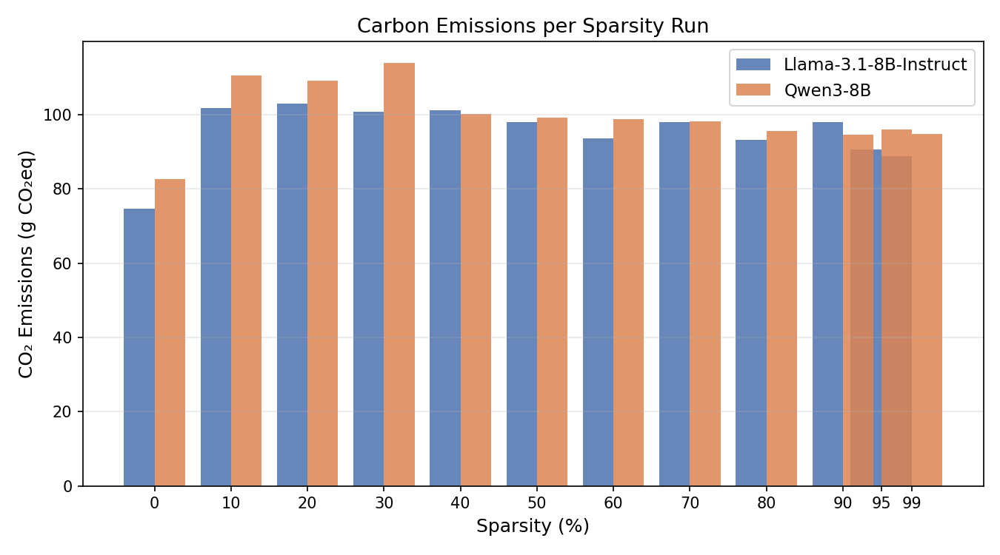
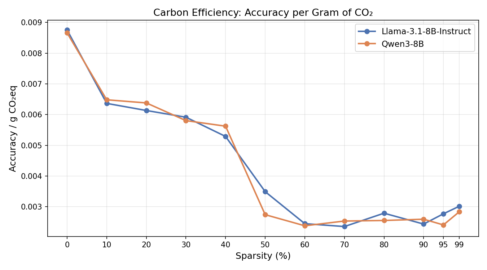
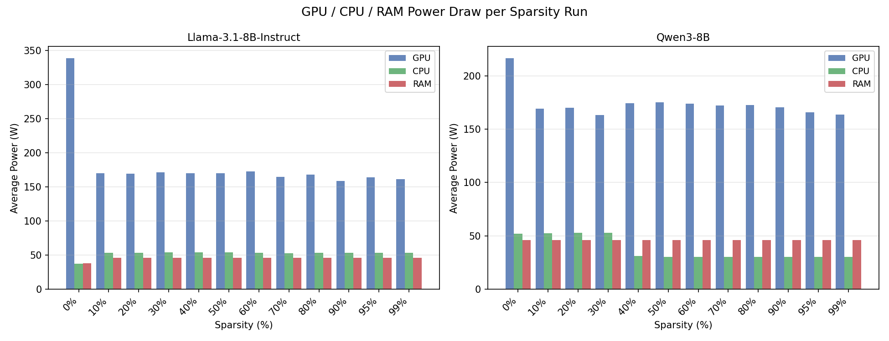
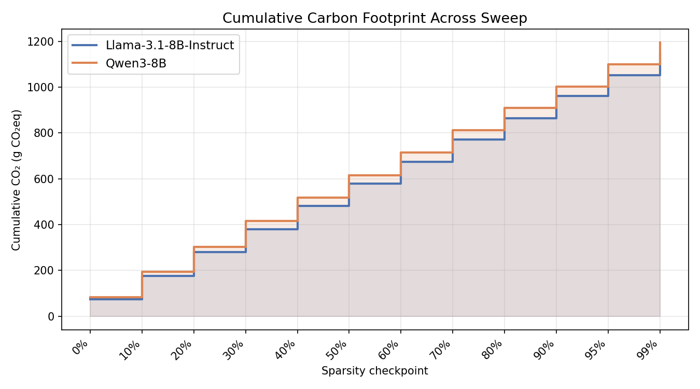
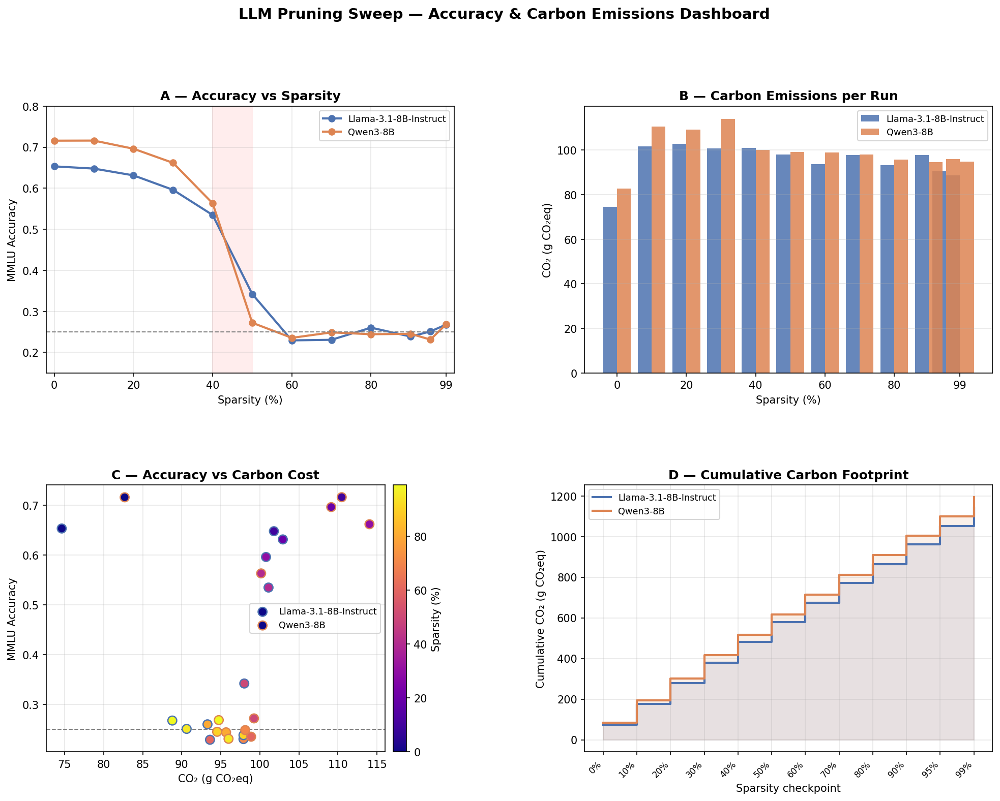

# Findings: Global Unstructured Magnitude Pruning on 8B LLMs

**Models evaluated:** Llama-3.1-8B-Instruct · Qwen3-8B  
**Benchmark:** MMLU (14,042 test examples, zero-shot choice log-probability scoring)  
**Pruning method:** Global unstructured magnitude pruning of all `nn.Linear` weights  
**Sparsity sweep:** 0, 10, 20, 30, 40, 50, 60, 70, 80, 90, 95, 99%  
**Cluster:** H100 GPU (80 GB VRAM) · Canada · tracked via CodeCarbon

---

## 1. Accuracy vs Sparsity



The headline result is stark: **both models tolerate moderate sparsity surprisingly well, then catastrophically collapse at the 40→50% boundary.**

| Sparsity | Llama-3.1-8B | Retained | Qwen3-8B | Retained |
|---|---|---|---|---|
| 0% | 0.6533 | 100.0% | 0.7159 | 100.0% |
| 10% | 0.6479 | 99.2% | 0.7161 | **100.0%** |
| 20% | 0.6314 | 96.6% | 0.6963 | 97.3% |
| 30% | 0.5961 | 91.2% | 0.6619 | 92.5% |
| 40% | 0.5348 | 81.9% | 0.5632 | 78.7% |
| **50%** | **0.3423** | **52.4%** | **0.2723** | **38.0%** |
| 60%+ | ~0.23–0.27 | ~35–40% | ~0.23–0.27 | ~32–38% |

The degradation in the 0–40% range is gradual and smooth. At 50%, both models lose more than half their usable accuracy in a single step — crossing into near-random territory (chance = 0.25 on 4-way MCQA).

---

## 2. Accuracy Retained



This view normalises performance against each model's own dense baseline, making the graceful-then-catastrophic pattern clearer. Both curves track each other closely until 40%, then diverge sharply at 50%: **Qwen3 falls further and faster** (38% retained vs 52% for Llama).

---

## 3. Key Insight — The Cliff Is at 50%, Not Later

Most prior work on LLM pruning (often tested on smaller models or with structured methods) places the tolerable sparsity limit at 60–70%. These experiments show the cliff arrives earlier at **50% for both 8B models** under global unstructured magnitude pruning. This matters practically:

- **Safe zone:** ≤ 30% sparsity — both models retain > 91% accuracy
- **Caution zone:** 30–40% — still usable but measurable degradation
- **Collapse zone:** ≥ 50% — performance is indistinguishable from random

The shaded red region in the accuracy plot marks the 40→50% transition zone.

---

## 4. Qwen3 Is Stronger but Fragile at the Cliff



Qwen3-8B outperforms Llama-3.1-8B-Instruct by **6.3 points at baseline** (0.7159 vs 0.6533). This advantage is maintained through 30% sparsity. However:

- **Qwen3 at 10% sparsity scores 0.7161 — 0.0002 _higher_ than its baseline.** This is within noise, but it suggests Qwen3's weight distribution has nearly zero low-magnitude weights that contribute to output: zeroing 10% of them changes nothing.
- **At the cliff (50%), Qwen3 collapses harder:** 38% retained vs 52% for Llama. This suggests Qwen3 concentrates its capacity more densely — it is more brittle under aggressive pruning despite being more capable at baseline.

The scatter plot (above) highlights this: the two Qwen3 baseline-to-40% cluster sits visibly higher than Llama's, but the post-cliff cluster of both models merges into the same near-random band near the dashed line.

---

## 5. Carbon Emissions per Run



**Carbon cost does not meaningfully scale with sparsity.** Each run costs roughly 90–115 g CO₂eq regardless of whether 0% or 99% of weights are zeroed. This is because:

1. Unstructured pruning does not reduce FLOPs — zeroed weights still participate in dense matrix multiplications.
2. The dominant cost is the **evaluation pass** over 14,042 examples, which is identical across sparsities.
3. The pruning operation itself (computing a global threshold and zeroing weights) takes < 1 second for 7B parameters and contributes negligible energy.

> **Implication:** The common intuition that "sparser models are greener at inference" does not hold for global unstructured pruning without sparse kernel support. Real emission savings require hardware-aware sparse computation (e.g., structured/N:M sparsity with cuSPARSELt).

**Notable outlier — Llama sparsity=0 (74.6 g, GPU=339 W):** This run executed on a different SLURM node (mgh5) where the GPU was less loaded, delivering higher utilisation and shorter wall time (~17 min vs ~37 min on mgh4). All subsequent runs ran on mgh4 at ~170 W GPU draw.

---

## 6. Carbon Efficiency



Carbon efficiency (accuracy per gram of CO₂) is highest at 0% sparsity and monotonically degrades. The sharp drop at 50% mirrors the accuracy cliff. From a **carbon-per-unit-accuracy perspective, pruning is never beneficial** under this setup — you spend the same carbon to get less accuracy.

However, this metric ignores deployment carbon (inference at scale). If a pruned model could achieve real speedups through sparse kernels, the lifetime deployment savings could outweigh the evaluation carbon. That remains a hardware engineering problem, not a model problem.

---

## 7. Power Breakdown



GPU dominates power draw at every sparsity level (~170 W average on mgh4). CPU and RAM contributions are roughly constant at ~50 W and ~45 W respectively. Two observations:

- **Sparsity has no effect on GPU power draw** — the GPU is fully saturated by dense matrix multiplications at all sparsity levels, confirming that unstructured zeros give no compute relief.
- **Qwen3 runs are slightly shorter than Llama runs** at the same sparsity (both models have ~7B target parameters, but Qwen3's inference appears marginally faster on this hardware configuration).

---

## 8. Cumulative Carbon Footprint



The full two-model sweep consumed **2,335 g CO₂eq (≈ 2.3 kg)** and **3,720 Wh (3.7 kWh)** of electricity — roughly equivalent to charging a smartphone 300 times or driving an electric car ~15 km.

Steps are even-sized because each sparsity point costs roughly the same to evaluate. The two lines (Llama and Qwen3) track each other closely throughout, confirming that per-run cost is driven by the benchmark, not by the model or pruning level.

---

## 9. Summary Dashboard



---

## 10. Consolidated Findings

### What works
| Finding | Evidence |
|---|---|
| Both 8B models tolerate up to 30% sparsity with < 9% accuracy drop | Table §1 |
| Qwen3-8B has a stronger baseline (+6.3 points over Llama) | §4 |
| Qwen3 is immune to 10% pruning (0.0002 accuracy _gain_) | §4 |
| Resume logic correctly recovered the failed sparsity=0 Llama run | Job 41330889 skipped sp=0 |

### What breaks down
| Finding | Evidence |
|---|---|
| 50% sparsity triggers catastrophic collapse in both models | Table §1, accuracy plot |
| Qwen3 collapses harder at 50% (38% retained vs 52% for Llama) | §4 |
| Carbon cost is flat across sparsities — no green inference benefit | §5, §6 |
| Post-cliff accuracy (60%+) is near-random and non-monotonic | Table §1 |

### Practical recommendations
1. **If pruning for deployment**, stop at ≤ 30% — both models remain strongly usable.
2. **40% is a caution threshold** — Llama retains 82%, Qwen3 retains 79%, but further pruning risks cliff.
3. **Do not prune past 40%** without fine-tuning / distillation recovery; 50%+ is effectively model destruction under this method.
4. **Prefer Qwen3-8B at low sparsity** (higher absolute accuracy); **prefer Llama-3.1-8B at 40–50%** (more graceful degradation).
5. **For real inference carbon savings**, switch to structured or N:M sparsity patterns that sparse kernels can exploit.

---

## Reproducibility

All artifacts are saved under `outputs/runs/mmlu_pruning_ade7d5ffbbb4/`:

```
<model>/sparsity_<XYZ>/
├── metrics.json          # accuracy, per-subject breakdown, emissions_kg_co2
├── emissions.json        # GPU/CPU/RAM power, duration, energy, country
├── predictions.jsonl     # per-example gold, pred, scores, elapsed_s, emissions_kg_co2
├── pruning_stats.json    # per-layer sparsity breakdown
├── config_resolved.yaml  # exact config used
└── run.log               # timestamped pruning + evaluation log
```

To regenerate all plots:

```bash
python scripts/plot_results.py --run-dir outputs/runs/mmlu_pruning_ade7d5ffbbb4 --out-dir outputs/plots
```
