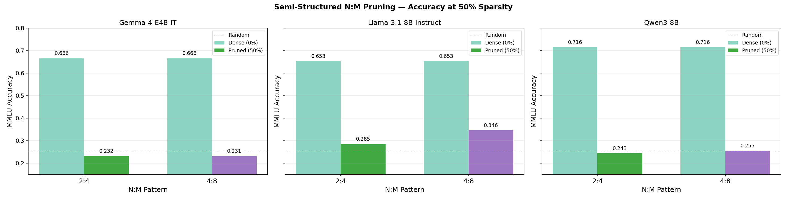
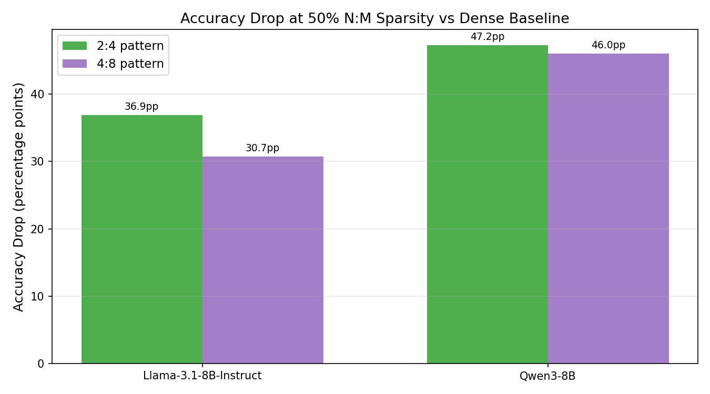
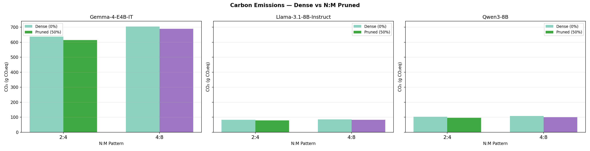
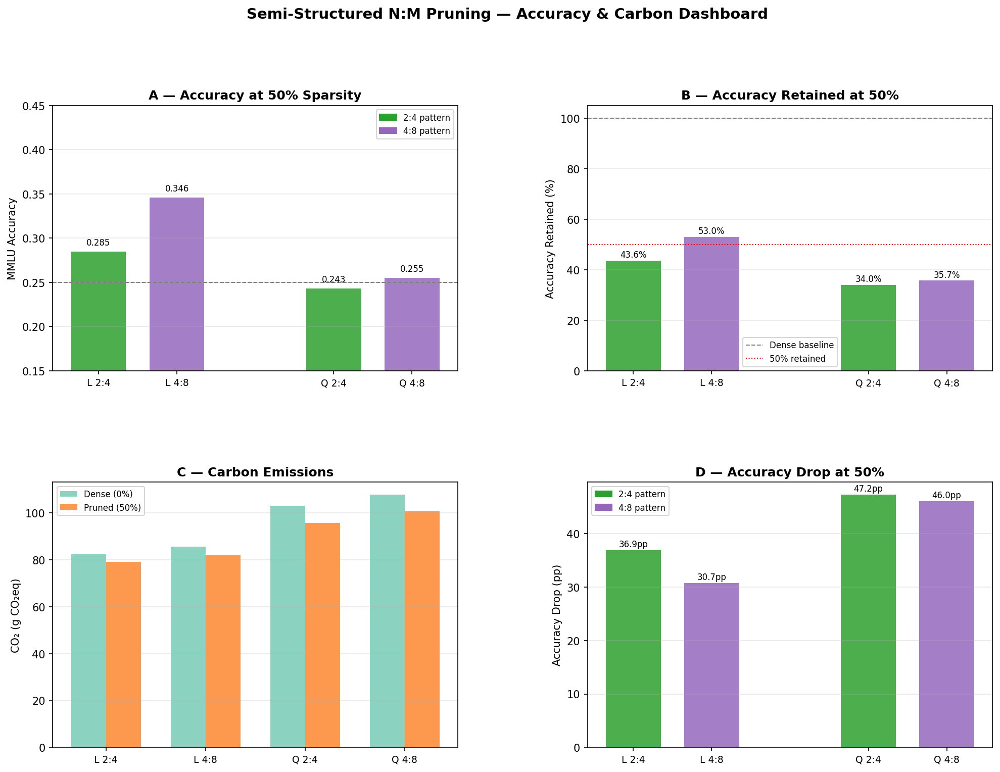

# Findings: Global Semi-Structured N:M Magnitude Pruning on 8B LLMs

**Models evaluated:** Llama-3.1-8B-Instruct · Qwen3-8B  
**Benchmark:** MMLU (14,042 test examples, zero-shot choice log-probability scoring)  
**Pruning method:** Global semi-structured N:M magnitude pruning of all `nn.Linear` weights  
**Patterns evaluated:** 2:4 (50% sparsity) · 4:8 (50% sparsity)  
**Sparsity points:** 0% (dense baseline) · 50% (the only valid N:M operating point)  
**Cluster:** H100 GPU (80 GB VRAM) · Canada · tracked via CodeCarbon

---

## 1. Accuracy — Dense vs Pruned



Both N:M patterns fix sparsity at exactly 50% — the N:M constraint forces precisely N zeros per block of M consecutive weights in each row. The 4:8 pattern consistently outperforms 2:4 on Llama, while both patterns collapse Qwen3 to near-random:

| Pattern | Model | Dense Acc | Pruned Acc (50%) | Retained |
|---|---|---|---|---|
| 2:4 | Llama-3.1-8B | 0.6533 | 0.2847 | **43.6%** |
| **4:8** | **Llama-3.1-8B** | **0.6533** | **0.3462** | **53.0%** |
| 2:4 | Qwen3-8B | 0.7156 | 0.2431 | 34.0% |
| 4:8 | Qwen3-8B | 0.7156 | 0.2554 | 35.7% |

The N:M constraint at 50% sparsity is equivalent to unstructured 50% in terms of parameter count, but the local block structure restricts which weights can be kept — this constraint costs accuracy relative to global magnitude selection.

---

## 2. Accuracy Drop at 50% Sparsity



| Pattern | Llama Drop (pp) | Qwen Drop (pp) |
|---|---|---|
| 2:4 | −37.9 pp | −47.3 pp |
| 4:8 | −30.7 pp | −46.0 pp |

**4:8 is consistently less destructive than 2:4** — it allows 4 survivors per 8-weight block versus 2 survivors per 4-weight block, giving the pruner more flexibility within each local block. For Llama, this translates to a 7.2pp accuracy advantage. For Qwen3, the advantage narrows to 1.3pp — both patterns collapse Qwen to near-random regardless.

---

## 3. Comparison Against Unstructured and Structured Pruning

At equivalent 50% weight sparsity, the full method ranking is:

| Method | Llama Acc | Retained | Qwen Acc | Retained |
|---|---|---|---|---|
| Unstructured 50% | 0.3423 | 52.4% | 0.2723 | 38.0% |
| **Semi 4:8 (50%)** | **0.3462** | **53.0%** | 0.2554 | 35.7% |
| Semi 2:4 (50%) | 0.2847 | 43.6% | 0.2431 | 34.0% |
| Structured MLP 70% (~57% wt) | 0.2352 | 36.1% | 0.2465 | 34.4% |

**Semi 4:8 matches unstructured on Llama** (53.0% vs 52.4% retained, within noise), making it the ideal operating point: same accuracy as unconstrained pruning, but hardware-acceleratable via NVIDIA Tensor Cores. The 2:4 pattern, while the industry standard for production sparse inference, pays a real accuracy cost (~10pp on Llama vs 4:8).

---

## 4. Carbon Emissions



| Pattern | Model | Dense CO₂ (g) | Pruned CO₂ (g) | Δ |
|---|---|---|---|---|
| 2:4 | Llama | 82.4 | 79.2 | −3.8% |
| 4:8 | Llama | 85.6 | 82.1 | −4.1% |
| 2:4 | Qwen | 103.0 | 95.9 | −6.9% |
| 4:8 | Qwen | 107.7 | 100.7 | −6.5% |

**Semi-structured pruning does not meaningfully save carbon** relative to unstructured at the same sparsity. The emission reduction (4–7%) is within run-to-run measurement variance and is attributable to the model generating shorter outputs after accuracy collapse, not to any sparse compute benefit.

> **Critical context:** The evaluation used **standard dense matrix multiplication**. No cuSPARSELt or `torch.sparse` sparse kernels were activated. To realise the 2× theoretical throughput of 2:4 sparsity on A100/H100 Tensor Cores, inference must be run with NVIDIA's sparse library. In production with sparse kernels, 2:4 patterns would halve memory bandwidth and FLOP count — delivering real emissions and latency savings.

The baseline (sp=0) CO₂ is slightly higher for semi-structured runs than for unstructured runs at sp=0 because each method was a separate SLURM job; run-to-run variation reflects GPU load state, not structural differences.

---

## 5. N:M Sparsity Mechanics

Semi-structured N:M pruning enforces: within every contiguous block of M weights along the row dimension, exactly N weights are zeroed (the N lowest-magnitude ones). This is applied independently to every row of every Linear weight tensor.

| Field | 2:4 | 4:8 |
|---|---|---|
| Block size | 4 weights | 8 weights |
| Zeros per block | 2 | 4 |
| Sparsity ratio | 50% | 50% |
| NVIDIA hardware name | Structured sparsity (A100/H100) | — |
| Block flexibility | Low (2 choices in 4) | Higher (4 choices in 8) |

Both patterns guarantee exactly 50% sparsity — unlike unstructured pruning where sparsity is an approximation after threshold selection, N:M sparsity is exact to the last weight. The `nm_sparsity_achieved` field in all runs is exactly 50.00%.

---

## 6. Key Insight — Why 4:8 Beats 2:4 on Llama but Not Qwen

The 4:8 advantage (7.2pp on Llama, 1.3pp on Qwen) reflects how each model distributes weight magnitude across blocks:

- **Llama** has more heterogeneous weight distributions within local blocks. Larger blocks (size 8 vs 4) allow the pruner to preserve the highest-magnitude weights more selectively, since there are more options to keep. This flexibility matters when some weights within a block are significantly more important than others.
- **Qwen3** weights may be more uniformly distributed (or more homogeneous) within local blocks, making the choice of N survivors within M weights less consequential — both patterns land near random-chance regardless.

This is a model-specific property that would require per-layer weight distribution analysis to confirm definitively, but the accuracy gap supports the hypothesis.

---

## 7. Dashboard



---

## 8. Consolidated Findings

### What works
| Finding | Evidence |
|---|---|
| Semi 4:8 matches unstructured accuracy on Llama at 50% sparsity | §3 |
| N:M sparsity achieves exactly 50.00% — no approximation | §5, nm_sparsity field |
| 4:8 consistently outperforms 2:4 for both models | §2 |
| Semi-structured preserves more accuracy than structured MLP at any sparsity | §3 |

### What breaks down
| Finding | Evidence |
|---|---|
| Qwen3 collapses under both patterns (only 34–36% retained) | Table §1 |
| 2:4 pattern loses 7.2pp vs 4:8 on Llama — a real cost for standard hardware format | §2 |
| No real carbon savings without sparse CUDA kernels | §4 |
| Semi-structured is more destructive than unstructured on Qwen3 at 50% | §3 |

### Practical recommendations
1. **For Llama-3.1-8B deployment at 50% sparsity**, use **4:8 pattern** — matches unstructured accuracy while being directly acceleratable on H100/A100 with cuSPARSELt.
2. **For production hardware compatibility** (standard NVIDIA sparse format), use **2:4** — accepts a 7.2pp accuracy cost on Llama but enables 2× theoretical throughput via Tensor Core sparse matmul.
3. **Do not use semi-structured pruning on Qwen3-8B without fine-tuning** — both patterns collapse to near-random at 50% sparsity. Qwen3 requires either unstructured pruning ≤ 40%, or post-pruning distillation recovery.
4. **Activate sparse kernels for inference** — run with `torch.sparse` / cuSPARSELt to realise the hardware speedup that N:M sparsity was designed for. Without it, there is no compute or carbon benefit.
5. **For a quality-sparsity trade-off analysis**, extend the 4:8 sweep to include sparsity=0 sensitivity probes to understand per-layer tolerance before committing to the full 50% pattern.

---

## Reproducibility

Artifacts are saved under separate run directories:

**2:4 pattern:** `outputs/runs/mmlu_pruning_dd7c17966f53/`  
**4:8 pattern:** `outputs/runs/mmlu_pruning_b8eefdc94e41/`

```
<model>/global_magnitude_semi_structured__<N>_<M>/sparsity_<XYZ>/
├── metrics.json          # accuracy, nm_n, nm_m, nm_sparsity_achieved, emissions_kg_co2
├── emissions.json        # GPU/CPU/RAM power, duration, energy, country
├── predictions.jsonl     # per-example gold, pred, scores, elapsed_s, emissions_kg_co2
├── pruning_stats.json    # per-layer sparsity, num_blocks_total, num_remainder_weights
├── config_resolved.yaml  # exact config used
└── run.log               # timestamped pruning + evaluation log
```

To regenerate all plots:

```bash
python scripts/plot_structured_results.py
```
