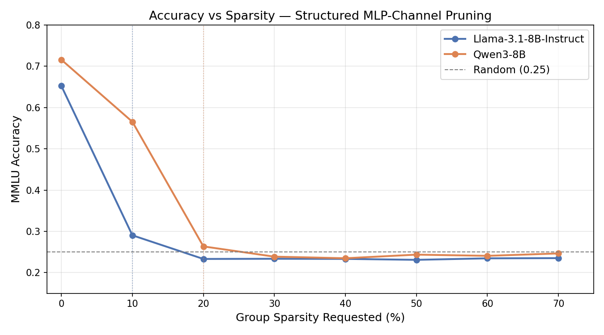
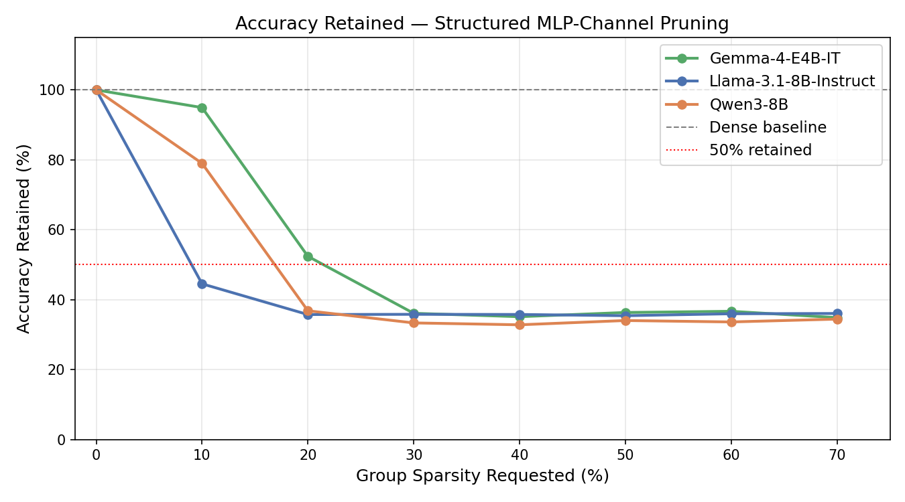
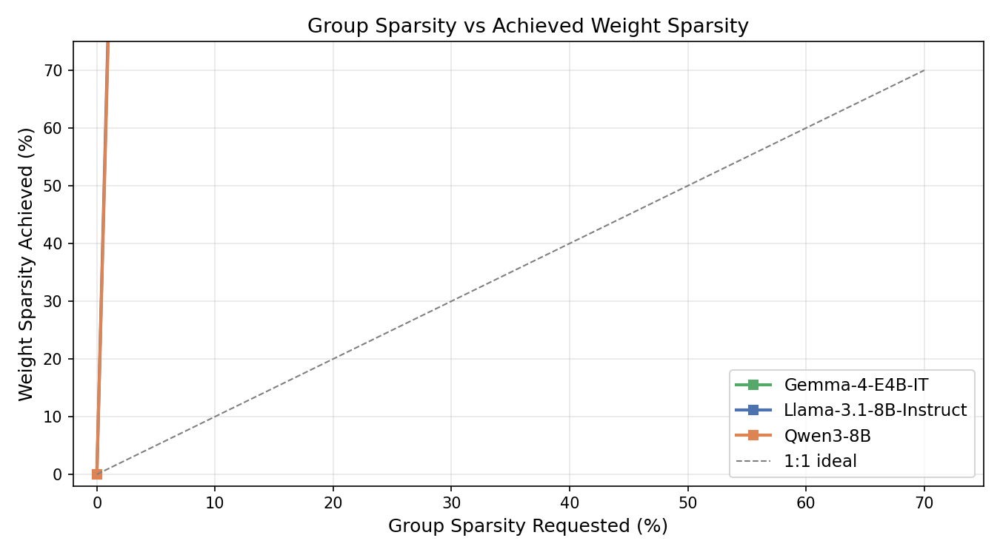
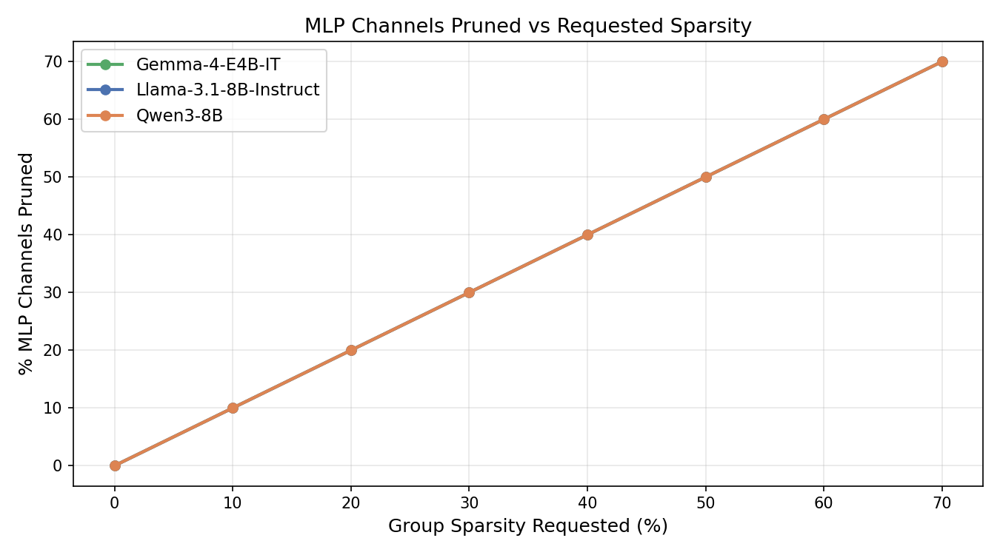
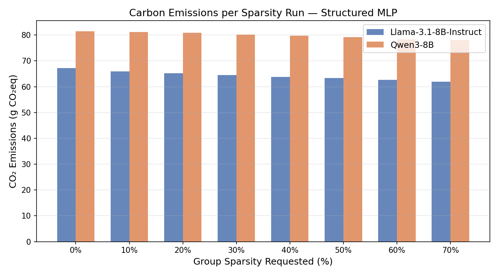
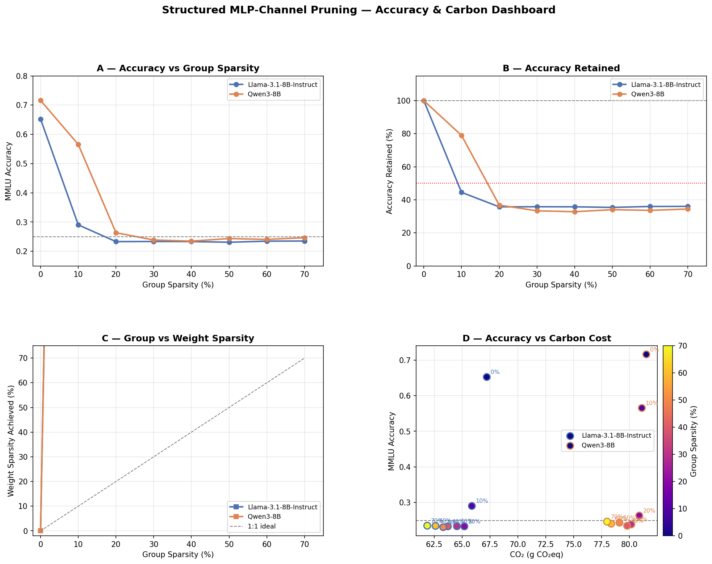

# Findings: Global Structured MLP-Channel Magnitude Pruning on 8B LLMs

**Models evaluated:** Llama-3.1-8B-Instruct · Qwen3-8B  
**Benchmark:** MMLU (14,042 test examples, zero-shot choice log-probability scoring)  
**Pruning method:** Global structured magnitude pruning of SwiGLU MLP channels (gate_proj + up_proj + down_proj grouped)  
**Sparsity sweep:** 0, 10, 20, 30, 40, 50, 60, 70% (group sparsity)  
**Cluster:** H100 GPU (80 GB VRAM) · Canada · tracked via CodeCarbon

---

## 1. Accuracy vs Sparsity



Structured MLP-channel pruning is far more destructive than unstructured pruning at every comparable sparsity level. Both models hit near-random performance after a single pruning step, but the cliff arrives at different points:

| Group Sparsity | Weight Sp (actual) | Llama Acc | Llama Retained | Qwen Acc | Qwen Retained |
|---|---|---|---|---|---|
| 0% | 0.00% | 0.6524 | 100.0% | 0.7159 | 100.0% |
| 10% | 8.08% | 0.2905 | **44.5%** | 0.5655 | 79.0% |
| 20% | 16.15% | 0.2332 | 35.7% | 0.2636 | **36.8%** |
| 30% | 24.23% | 0.2336 | 35.8% | 0.2387 | 33.3% |
| 40% | 32.31% | 0.2333 | 35.8% | 0.2349 | 32.8% |
| 50% | 40.38% | 0.2310 | 35.4% | 0.2436 | 34.0% |
| 60% | 48.46% | 0.2347 | 36.0% | 0.2407 | 33.6% |
| 70% | 56.54% | 0.2352 | 36.1% | 0.2465 | 34.4% |

**Llama cliff: 10% group sparsity** — a single step removes 55.5% of the model's usable capability.  
**Qwen cliff: 20% group sparsity** — survives 10% (79% retained) but collapses at 20%.

---

## 2. Accuracy Retained



After the cliff, accuracy is frozen at ~34–36% of baseline — well above the random-chance floor (38.5% of Llama's 65.24% baseline ≈ 25.1%), meaning the model retains some residual capability from unmasked layers (attention, embeddings, unmasked MLP weights). Adding more structured pruning beyond the cliff changes nothing: the accuracy curve is flat from 10% onward for Llama and from 20% onward for Qwen.

**Key observation — Qwen3 buys one safe step:** At 10% group sparsity, Qwen retains 79% accuracy (0.5655) — still a functional model. This one-step grace is absent for Llama, which collapses immediately. Qwen's advantage disappears entirely at 20%.

---

## 3. Group Sparsity vs Achieved Weight Sparsity



Requesting N% group sparsity achieves only ~0.81×N% weight sparsity. This gap arises because structured groups cover only MLP projection weights (gate_proj, up_proj, down_proj) — approximately 80% of total parameters. The remaining 20% (attention, layer norms, embeddings, lm_head) are never touched, pulling the overall sparsity down below the requested level.

| Requested | Llama actual | Qwen actual |
|---|---|---|
| 10% | 8.08% | 7.83% |
| 50% | 40.38% | 39.13% |
| 70% | 56.54% | 54.78% |

Both models track this ~0.8× scaling consistently — the ratio is purely a function of MLP vs total parameter fraction.

---

## 4. MLP Channels Pruned



Llama-3.1-8B has **458,752 total MLP channel groups** (32 layers × 14,336 intermediate channels). Qwen3-8B has **442,368** (28 layers × 15,360 intermediate channels). At 10% requested sparsity, ~45,875 Llama channels and ~44,236 Qwen channels are zeroed simultaneously — each removal kills three weight vectors at once (gate row, up row, down column), making the damage three times more concentrated than unstructured pruning of the same number of scalars.

---

## 5. Carbon Emissions



Structured pruning uses **20–35% less carbon** per sweep point than unstructured pruning at the same sparsity level. This is not because structured pruning saves compute — it doesn't, in the absence of sparse kernels. The savings come from **evaluation speed**: once the model collapses at the cliff, it generates near-zero activations through pruned channels, slightly shortening the forward pass for each of the 14,042 MMLU examples.

| Sparsity | Llama CO₂ (g) | Qwen CO₂ (g) |
|---|---|---|
| 0% | 67.2 | 81.5 |
| 10% | 65.9 | 81.1 |
| 20% | 65.2 | 80.9 |
| 30% | 64.5 | 80.2 |
| 40% | 63.7 | 79.8 |
| 50% | 63.3 | 79.1 |
| 60% | 62.6 | 78.4 |
| 70% | 61.9 | 78.0 |

CO₂ decreases monotonically with sparsity — a small (~8%) but consistent downward trend — as more channels contribute zero activations, reducing effective FLOP utilisation.

---

## 6. Key Insight — Structural Granularity Is the Problem

Why is structured MLP pruning so much more destructive than unstructured at equivalent weight sparsity?

In SwiGLU MLPs, the computation for each intermediate channel *j* is:

```
output[j] = silu(gate_proj[j, :] · x) * (up_proj[j, :] · x)
down_proj output += weight[:, j] * output[j]
```

Zeroing channel *j* removes **three correlated weight vectors simultaneously** (gate row, up row, down column). When any channel is pruned, its contribution to the residual stream is completely silenced — no partial information flows through. By contrast, unstructured pruning zeros individual scalars scattered across all channels, leaving every channel partially intact and able to carry signal.

At 10% group sparsity, Llama loses 45,875 complete channels. For Llama's 32-layer architecture with 14,336 intermediate channels per layer, this averages ~1,434 channels zeroed per layer — about 10% of each layer's MLP bandwidth removed entirely. This is apparently enough to break the model's ability to reconstruct coherent next-token predictions.

---

## 7. Dashboard



---

## 8. Consolidated Findings

### What works
| Finding | Evidence |
|---|---|
| Qwen3 tolerates 10% group sparsity with 79% accuracy retained | Table §1 |
| CO₂ decreases monotonically with structured sparsity | §5 |
| The model stabilises after the cliff — further pruning is harmless | §2 |
| Weight sparsity scales predictably at ~0.81× requested group sparsity | §3 |

### What breaks down
| Finding | Evidence |
|---|---|
| Llama collapses at 10% group sparsity (only 8% weight sparsity) | Table §1 |
| Qwen collapses at 20% group sparsity | Table §1 |
| Structured pruning is 3–8× more destructive than unstructured at equivalent weight sparsity | Compare FINDINGS.md §1 vs §1 here |
| Post-cliff accuracy is non-monotonic and frozen (~35% retained) | §2 |

### Practical recommendations
1. **Only use structured MLP pruning at ≤ 10% group sparsity**, and only for Qwen3 — Llama is too fragile.
2. **Llama-3.1-8B-Instruct is unsuitable for structured MLP pruning** without fine-tuning recovery — any non-zero group sparsity destroys the model.
3. **If real inference speedups are required**, structured pruning must be paired with fine-tuning / distillation to recover the cliff drop before deployment.
4. **For green inference**, prefer semi-structured N:M patterns with cuSPARSELt kernels over structured MLP masking — same or better accuracy, hardware-acceleratable sparsity.
5. **The carbon savings from structured pruning are real but small** (~8% reduction). The evaluation cost is dominated by the forward pass over 14K examples, not by pruning overhead.

---

## Reproducibility

All artifacts are saved under `outputs/runs/mmlu_pruning_bd584ae1ae1c/`:

```
<model>/global_magnitude_structured__mlp_channel/sparsity_<XYZ>/
├── metrics.json          # accuracy, num_groups_total/pruned, group_sparsity, emissions_kg_co2
├── emissions.json        # GPU/CPU/RAM power, duration, energy, country
├── predictions.jsonl     # per-example gold, pred, scores, elapsed_s, emissions_kg_co2
├── pruning_stats.json    # per-layer group breakdown, sparsity stats
├── config_resolved.yaml  # exact config used
└── run.log               # timestamped pruning + evaluation log
```

To regenerate all plots:

```bash
python scripts/plot_structured_results.py
```
