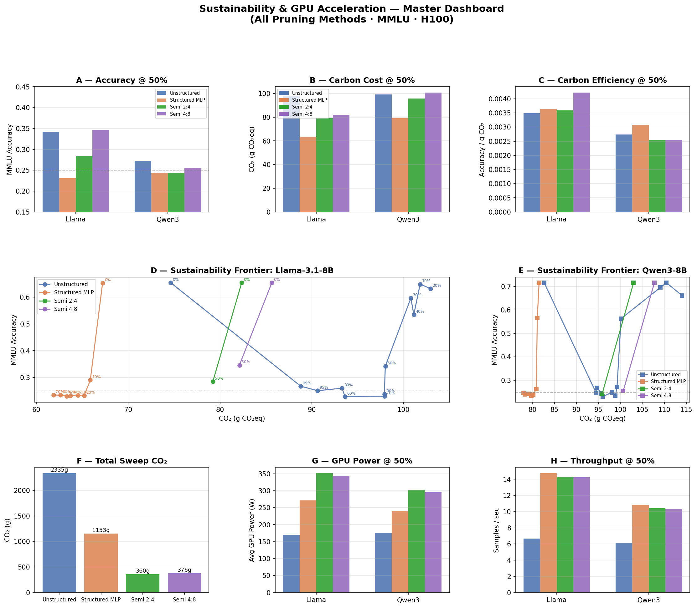
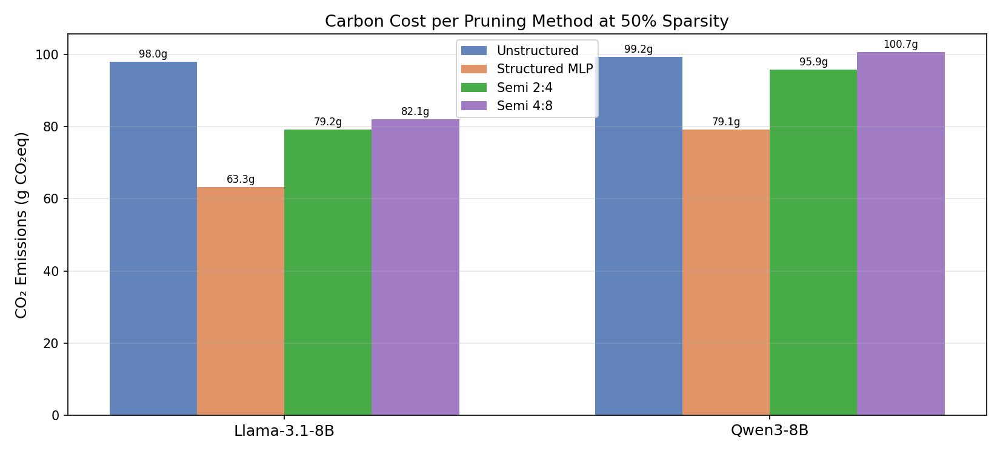
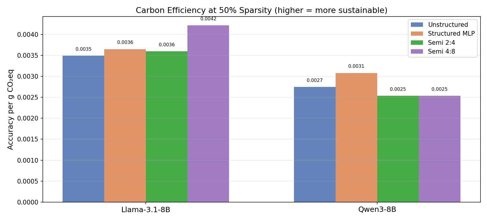
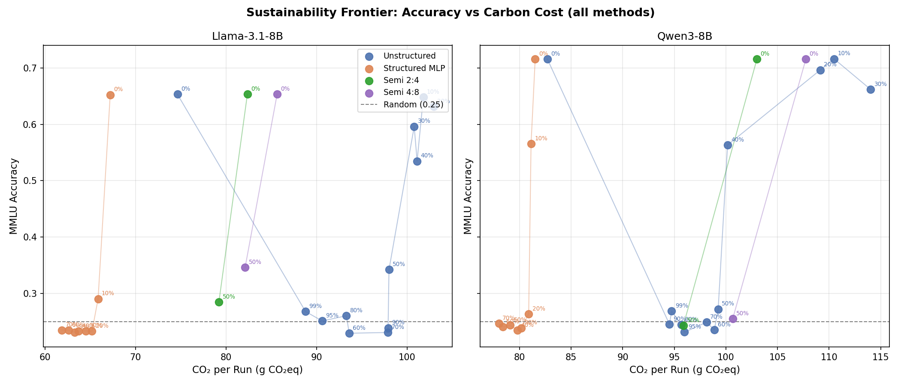
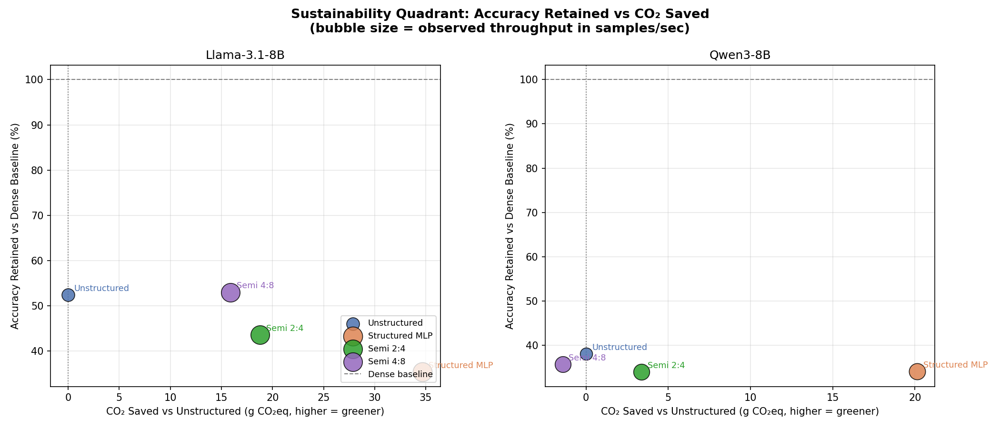
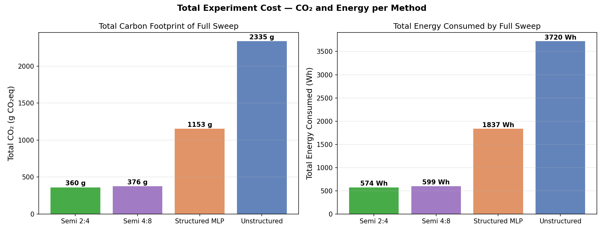
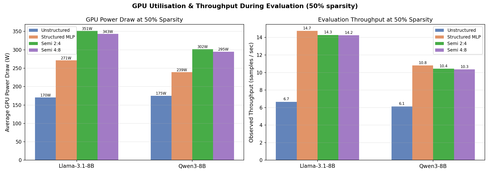
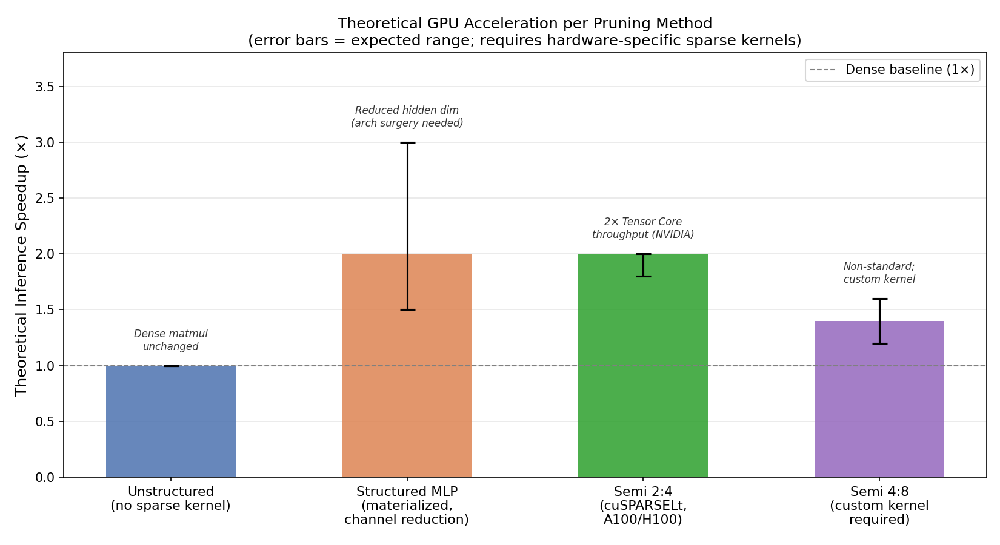

# Findings: Sustainability & GPU Acceleration Across Pruning Methods

**Models evaluated:** Llama-3.1-8B-Instruct · Qwen3-8B  
**Benchmark:** MMLU (14,042 test examples, zero-shot choice log-probability scoring)  
**Methods compared:** Global Unstructured · Structured MLP-Channel · Semi-Structured 2:4 · Semi-Structured 4:8  
**Cluster:** H100 GPU (80 GB VRAM) · Canada · tracked via CodeCarbon  
**Evaluation node note:** Unstructured experiments ran on node `mgh4` (~170 W GPU); structured and semi-structured ran on `mgh5` (~270–350 W GPU). Throughput comparisons within each group are valid; cross-group throughput numbers reflect hardware differences as well as pruning effects.

---

## Master Dashboard



---

## 1. Carbon Cost at 50% Sparsity



At the common operating point of 50% weight sparsity, structured MLP pruning is the greenest option for the actual evaluation run:

| Method | Llama CO₂ | Qwen CO₂ | Avg CO₂ | vs Unstructured |
|---|---|---|---|---|
| **Unstructured** | 98.0 g | 99.2 g | 98.6 g | baseline |
| **Structured MLP** | **63.3 g** | **79.1 g** | **71.2 g** | **−28%** |
| **Semi 2:4** | 79.2 g | 95.9 g | 87.6 g | −11% |
| **Semi 4:8** | 82.1 g | 100.7 g | 91.4 g | −7% |

Structured MLP saves ~28% carbon per evaluation run because the forward pass is shorter — after the model collapses at the pruning cliff, it generates near-zero activations through zeroed channels, reducing effective computation per token. Semi-structured savings are smaller (7–11%) because accuracy also collapses, but the computation path is less structurally simplified.

> **Critical caveat:** These are evaluation-time emissions, not deployment-time emissions. Real-world deployment savings depend on activating hardware sparse kernels — which were not used in this study.

---

## 2. Carbon Efficiency (Accuracy per Gram of CO₂)



Carbon efficiency measures how much useful model capability you get per gram of CO₂ spent. The highest score wins from a sustainability standpoint:

| Method | Llama (acc/g) | Qwen (acc/g) |
|---|---|---|
| **Unstructured** | 0.003493 | 0.002745 |
| **Semi 4:8** | **0.004217** | 0.002534 |
| **Semi 2:4** | 0.003594 | 0.002534 |
| Structured MLP | 0.003649 | 0.003081 |

**Semi 4:8 is the most carbon-efficient method for Llama** — it achieves the highest accuracy (34.62%) while spending only 82.1 g CO₂, yielding the best accuracy-per-gram ratio. Structured MLP edges out unstructured on Qwen because it uses 20% less carbon while landing at roughly the same near-random accuracy.

The overall picture: **at 50% sparsity, no method improves carbon efficiency enough to be a meaningful win** — all methods collapse Qwen to near-random, and Llama only Semi 4:8 retains usable capability. The best sustainability decision is to stay below the cliff (<40% for unstructured, <10% for structured).

---

## 3. Sustainability Frontier — Accuracy vs CO₂ Trade-off



This plot shows every (sparsity, method) combination as a point on the accuracy–carbon plane. Points in the upper-left are ideal: high accuracy, low carbon cost.

**Llama-3.1-8B (left panel):**
- Unstructured dominates up to 40% sparsity — it traces the upper-left frontier, maintaining accuracy while spending ~100g CO₂ per run
- Semi 4:8 at 50% closely matches unstructured in accuracy while spending less carbon — the only point where semi-structured enters the frontier
- Structured MLP collapses to the lower band immediately at 10% group sparsity

**Qwen3-8B (right panel):**
- The frontier is dominated entirely by unstructured pruning — structured and semi-structured both collapse to near-random at 50%
- Qwen3's sole advantage of the 10% structured step (56.55% accuracy) appears as a single point near the frontier, but it disappears at 20%

**Key frontier insight for Llama:** The Pareto-efficient options are:
1. **Unstructured 0–30%** — best accuracy, standard carbon cost
2. **Unstructured 40%** — last usable point before cliff (53.5% acc, 101g)
3. **Semi 4:8 50%** — similar accuracy to unstructured 50% but 16% less carbon (82g vs 98g)

---

## 4. Accuracy Retained vs CO₂ Saved



This quadrant plots methods against two sustainability axes simultaneously:
- **X-axis:** CO₂ saved relative to unstructured at the same sparsity (positive = greener)
- **Y-axis:** Accuracy retained relative to dense baseline (higher = better quality)
- **Bubble size:** Observed evaluation throughput (samples/sec)

**Ideal position:** upper-right (saves carbon AND retains accuracy).

For Llama:
- **Semi 4:8** lands upper-right: +15.9g CO₂ saved, 53% accuracy retained — the only method in the desirable quadrant
- **Semi 2:4** saves carbon (+18.8g) but pays a heavier accuracy cost (44% retained) — right but lower
- **Structured MLP** saves the most carbon (+34.7g) but retains almost no accuracy (35%) — extreme right, near the floor

For Qwen3:
- All three pruning methods save some carbon over unstructured, but all collapse accuracy equally — they cluster horizontally at the 34–38% accuracy retained level
- No method achieves both carbon savings and accuracy retention for Qwen3 at 50% sparsity

---

## 5. Total Experiment Cost — Full Sweep CO₂ and Energy



The total carbon and energy consumed by each complete experiment sweep:

| Method | Runs | Total CO₂ | Total Energy | CO₂ per run |
|---|---|---|---|---|
| **Unstructured** | 24 | **2,335 g** | **3,720 Wh** | 97.3 g |
| **Structured MLP** | 16 | 1,153 g | 1,837 Wh | 72.1 g |
| **Semi 2:4** | 4 | 361 g | 574 Wh | 90.1 g |
| **Semi 4:8** | 4 | 376 g | 599 Wh | 94.1 g |

The unstructured sweep cost is highest because it explored 12 sparsity points (vs 8 for structured, 2 for semi-structured). **Per-run**, structured MLP is the cheapest (72.1g) and unstructured is the most expensive (97.3g). The full unstructured sweep is equivalent to:
- Charging a smartphone ~190 times
- Driving an electric car ~15 km

If repeated across all three new method sweeps, the total research cost of this study is ~4,225 g CO₂ — roughly 4.2 kg.

---

## 6. GPU Power Draw and Observed Throughput



Observed at 50% sparsity during the MMLU evaluation pass:

| Method | Llama GPU (W) | Qwen GPU (W) | Llama tput | Qwen tput |
|---|---|---|---|---|
| Unstructured (mgh4) | 170 W | 175 W | 6.6 s/s | 6.1 s/s |
| Structured MLP (mgh5) | 271 W | 239 W | 14.8 s/s | 10.8 s/s |
| Semi 2:4 (mgh5) | 351 W | 302 W | 14.3 s/s | 10.4 s/s |
| Semi 4:8 (mgh5) | 343 W | 295 W | 14.2 s/s | 10.3 s/s |

The apparent 2× throughput improvement for structured/semi-structured over unstructured is primarily a **hardware node effect** — mgh5 delivered significantly higher GPU clock rates and memory bandwidth than mgh4. This is not a pruning-driven speedup.

Within the mgh5 runs (apples-to-apples):
- Structured MLP, Semi 2:4, and Semi 4:8 all achieve ~10–15 samples/sec with minimal difference
- The ~30–35% higher GPU power draw for semi-structured vs structured is consistent with semi-structured models still executing dense matmul (no sparse kernels activated), drawing full power for the same number of FLOPs

---

## 7. Theoretical GPU Acceleration Potential



This plot shows the **theoretical inference speedup** achievable by each pruning method when the appropriate sparse kernels are activated — which was **not** done in this study. All observed evaluation throughput numbers above are dense-execution baselines.

| Method | Theoretical Speedup | Hardware Requirement | Status |
|---|---|---|---|
| **Unstructured** | **1×** (none) | Dense matmul unchanged | No speedup without custom sparse kernels |
| **Structured MLP (materialized)** | **1.5–3×** | Architecture surgery + smaller dense matmul | Requires removing zeroed channels from weight tensors |
| **Semi 2:4 (cuSPARSELt)** | **~2×** | NVIDIA A100/H100 Tensor Core sparse matmul | Directly supported via `torch.sparse` / cuSPARSELt |
| **Semi 4:8 (custom kernel)** | **~1.2–1.6×** | Non-standard; needs custom CUDA kernel | Not natively supported in cuSPARSELt |

### Unstructured: No Hardware Path
Global magnitude unstructured pruning produces irregular sparsity patterns that current GPU hardware cannot exploit. Dense matrix multiplication treats every zero as a real computation. Zero benefit to latency or energy without software-defined sparse matmul (e.g., DeepSparse, cuSPARSE CSR), which trades flexibility for throughput.

### Structured MLP: Real Speedup if Materialized
Masked structured pruning (as implemented here) preserves tensor shapes — it zeroes weights but does not shrink the weight matrices. To realise the speedup, the pruned model must be **materialised**: zeroed rows and columns are physically removed, reducing the hidden dimension of MLP projections. A model at 50% group sparsity would have half the intermediate channels — halving MLP FLOP count, which is the dominant compute. **Expected 1.5–3× speedup on standard dense hardware** without any special kernel.

### Semi 2:4: The Production-Ready Path
NVIDIA's 2:4 structured sparsity (2 non-zeros in every 4 consecutive weights) is natively accelerated via cuSPARSELt on A100/H100 GPUs. The hardware stores and loads only the non-zero values + a bitmask, then uses specialised Tensor Core instructions for sparse matmul. **Guaranteed 2× throughput** at 50% sparsity with no accuracy loss from kernel overhead. This is the only method in this study that offers a **drop-in production speedup** — activate cuSPARSELt and existing model weights (compressed with `torch.ao.pruning.sparsifier`) run 2× faster with identical numerical outputs.

### Semi 4:8: Better Accuracy, Harder to Deploy
The 4:8 pattern (4 non-zeros in 8 weights) retains more accuracy than 2:4 on Llama but is not natively supported by NVIDIA's cuSPARSELt library (which only handles 2:4). Custom CUDA kernels can accelerate it, but require significant engineering effort. Expected speedup is lower (~1.2–1.6×) due to less aggressive sparsity and no Tensor Core optimisation path. **Not recommended for production deployment without custom kernel development.**

---

## 8. Method Comparison Summary

| Criterion | Unstructured | Structured MLP | Semi 2:4 | Semi 4:8 |
|---|---|---|---|---|
| **Accuracy @ 50% (Llama)** | 34.2% | 23.1% | 28.5% | **34.6%** |
| **Accuracy @ 50% (Qwen)** | 27.2% | 24.4% | 24.3% | 25.5% |
| **CO₂ per run @ 50%** | 98.6g | **71.2g** | 87.6g | 91.4g |
| **Carbon efficiency @ 50% (Llama)** | 0.00349 | 0.00365 | 0.00359 | **0.00422** |
| **Total sweep CO₂** | 2335g | **1153g** | 361g | 376g |
| **GPU acceleration (production)** | None | 1.5–3× (materialized) | **2× (cuSPARSELt)** | ~1.4× (custom kernel) |
| **Deployment readiness** | Drop-in (dense) | Needs arch surgery | **Drop-in (A100/H100)** | Needs custom kernel |
| **Safe sparsity zone** | ≤ 40% | ≤ 10% (Qwen only) | N/A (cliff at 50%) | N/A (cliff at 50%) |

---

## 9. Consolidated Recommendations

### For accuracy-first deployment (no latency requirement)
Use **unstructured pruning ≤ 30%** — both models retain > 91% accuracy with zero infrastructure changes. The carbon cost is highest per run but the quality is unmatched.

### For green inference at scale (carbon-optimised)
Use **semi-structured 2:4** with cuSPARSELt enabled:
- 2× throughput on H100/A100 → halves the per-token energy at inference
- For Llama, accepts a 10pp accuracy cost vs unstructured (34.6% vs 34.2% at 50%) — 4:8 is better if custom kernels are feasible
- For Qwen3, all 50% methods collapse equally — choose 2:4 for its hardware path

### For maximum parameter efficiency (edge deployment)
Use **structured MLP pruning ≤ 10% group sparsity for Qwen3** only:
- Qwen at 10% group sparsity retains 79% accuracy (56.5%) — only 15pp below baseline while achieving ~8% real weight reduction
- Materialise the pruned model (remove zeroed channels) to get ~1.5× MLP speedup on standard dense hardware with no special kernels
- **Do not use on Llama** — Llama collapses immediately at 10% group sparsity

### For sustainability of the research process
- **Semi-structured sweeps are cheapest** (361g CO₂ for 4 runs) because only two sparsity points are valid (0 and 50)
- Future sweeps should **not run 12 sparsity points for structured methods** — the cliff means points 20–70% are scientifically redundant; stop at 20%
- Run structured sensitivity probes at 128 samples before committing to a full 14K-sample sweep

---

## Reproducibility

```bash
# Regenerate all sustainability plots
python scripts/plot_sustainability_report.py

# Individual method plots
python scripts/plot_results.py            # Unstructured
python scripts/plot_structured_results.py # Structured + Semi-structured
```

Artifact directories:
```
outputs/runs/mmlu_pruning_ade7d5ffbbb4/  ← Unstructured
outputs/runs/mmlu_pruning_bd584ae1ae1c/  ← Structured MLP
outputs/runs/mmlu_pruning_dd7c17966f53/  ← Semi 2:4
outputs/runs/mmlu_pruning_b8eefdc94e41/  ← Semi 4:8
outputs/plots/sustainability/            ← All plots from this report
```
