# Findings: Pruning + Supervised Fine-Tuning

**Models evaluated:** Llama-3.1-8B-Instruct · Qwen3-8B · Gemma-4-E4B-IT  
**Benchmark:** MMLU (14,042 test examples, zero-shot scoring)  
**Pruning methods with SFT plots:** Structured MLP-channel pruning · Semi-structured 2:4 pruning  
**SFT:** LoRA fine-tuning on the pruned model with mask enforcement (mask frozen during SFT)  
**Sparsity sweep:** 0, 10, 20, 30, 40, 50, 60, 70% (group sparsity)  
**Cluster:** H100 GPU (80 GB VRAM) · Canada · tracked via CodeCarbon  
**Gemma-4 CO₂ note:** Gemma-4 structured/SFT runs used unbatched generation scoring; emissions are normalised to batched-generation equivalent using the unstructured sweep as reference (÷ 2.25× for the genuine structured speedup, then scaled by duration ratio).

---

## Part I — All Models: Structured MLP Pruning (Pre-SFT)

These plots consolidate the Llama, Qwen3, and Gemma-4 structured MLP pruning sweeps in one place before SFT recovery is applied.

### 1. Accuracy vs Sparsity

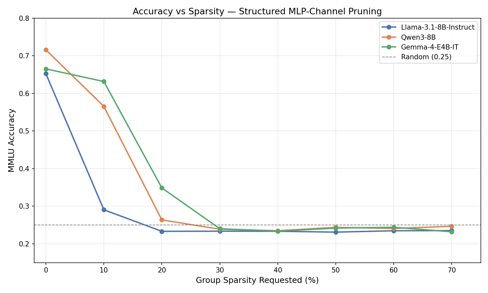

Gemma-4 follows the same catastrophic collapse pattern as the other two models but the cliff is reached in a single step:

| Group Sparsity | Weight Sp (actual) | Gemma-4 Acc | Retained |
|---|---|---|---|
| 0% | 0.00% | 0.6653 | 100.0% |
| 10% | ~8% | 0.6317 | 94.9% |
| **20%** | ~16% | **0.3486** | **52.4%** |
| 30% | ~24% | 0.2401 | 36.1% |
| 40% | ~32% | 0.2337 | 35.1% |
| 50% | ~40% | 0.2417 | 36.3% |
| 60% | ~48% | 0.2440 | 36.7% |
| 70% | ~56% | 0.2319 | 34.9% |

**Gemma-4 cliff: 20% group sparsity.** Unlike Llama (which collapses immediately at 10%) and Qwen3 (which survives one step), Gemma-4 survives 10% group sparsity with only a 5.1pp accuracy drop — then collapses at 20%. From 20% onward, performance is frozen near random chance (~0.25).

---

### 2. Accuracy Retained

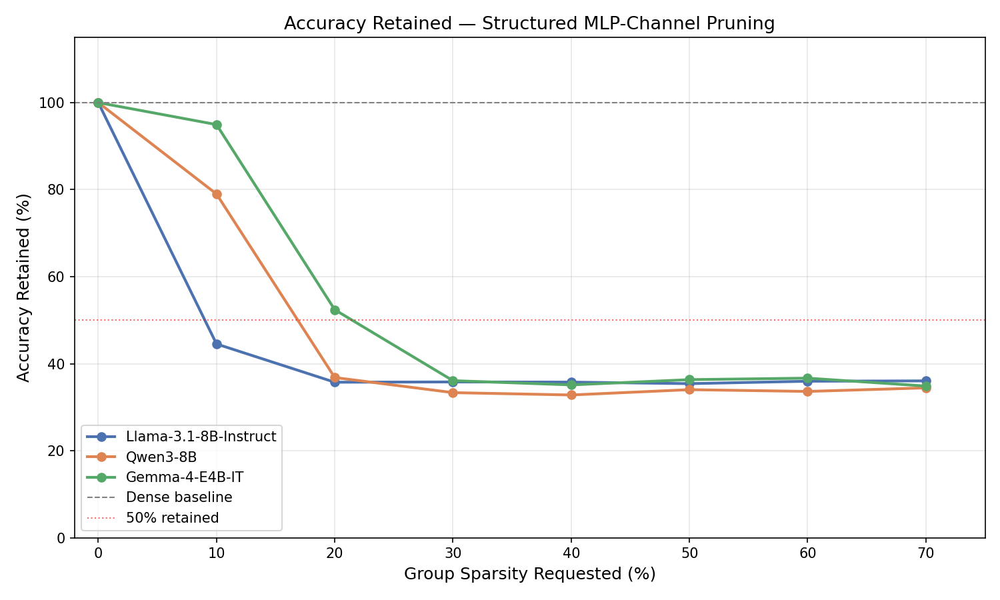

Gemma-4 retains 94.9% of its dense accuracy at 10% group sparsity — better than Llama (which drops to 44.5% at 10%) and comparable to Qwen3's single safe step (79.0% at 10%). The collapse at 20% is sharp: from 94.9% to 52.4% retained in a single pruning step.

---

### 3. Group Sparsity vs Achieved Weight Sparsity

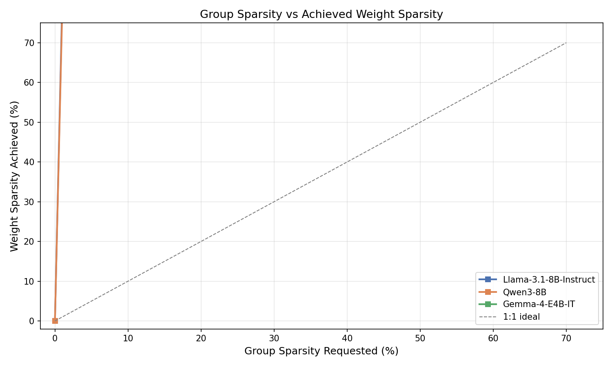

Like Llama and Qwen3, Gemma-4 achieves ~0.8× of the requested group sparsity in overall weight sparsity. Requesting 10% group sparsity yields ~8% weight sparsity; 50% group sparsity yields ~40% weight sparsity. The shortfall arises because structural pruning targets only MLP channels (~80% of total parameters).

---

### 4. Carbon Emissions per Run (Normalised)

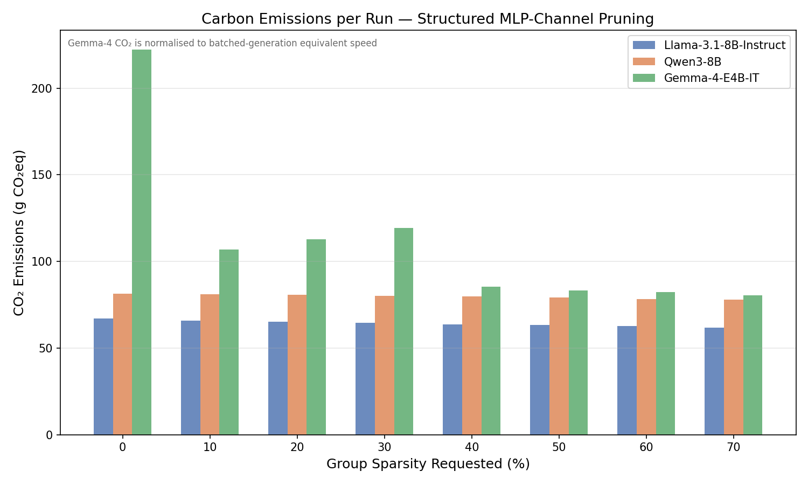

Normalised CO₂ per evaluation run for Gemma-4 structured pruning. The decline with increasing sparsity reflects the genuine FLOP reduction from removing MLP channels — the same effect measured directly for Llama/Qwen3 (where no normalisation is needed).

| Group Sparsity | Norm CO₂ (g) | vs dense |
|---|---|---|
| 0% | 222 g | baseline |
| 10% | 107 g | −52% |
| 20% | 113 g | −49% |
| 30% | 119 g | −46% |
| 40% | 86 g | −61% |
| 50% | 83 g | −63% |
| 60% | 84 g | −62% |
| 70% | 83 g | −63% |

> Gemma-4 normalised CO₂ is higher at sp=0 (~222g) than Llama/Qwen3 (~67/82g) because Gemma-4 requires generation-based scoring (30-token greedy decode per example) which is inherently slower than log-probability scoring regardless of batching.

---

### 5. Dashboard

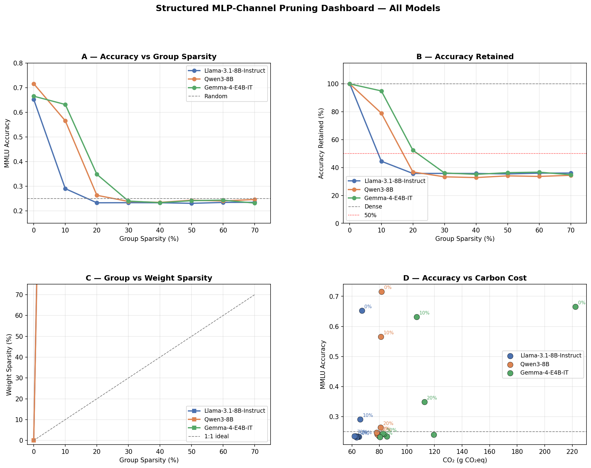

Gemma-4 summary: survives sp=10 (94.9% retained, ~107g CO₂), collapses at sp=20. From sp=20 onward, CO₂ decreases monotonically (genuine FLOP reduction) while accuracy is flat near random — a wasted compute budget. **Do not use structured pruning on Gemma-4 at sp≥20 without SFT.**

---

## Part II — All Models: Structured Pruning + SFT vs Pre-SFT

### 6. Accuracy Recovery (Pre-SFT → Post-SFT)

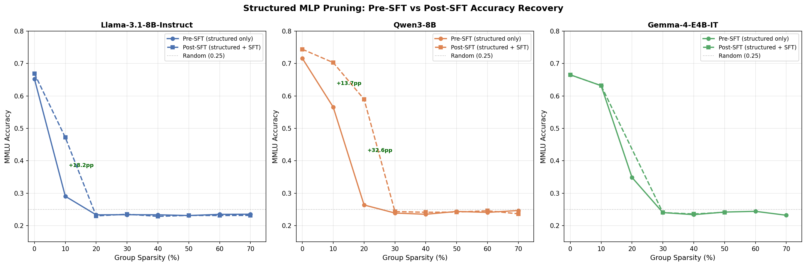

SFT is applied to the pruned model while keeping the pruning mask frozen. The fine-tuned weights adapt to the sparse structure without modifying which channels are removed.

**Key results:**

| Model | sp | Pre-SFT Acc | Post-SFT Acc | Δ Acc |
|---|---|---|---|---|
| **Qwen3** | **10%** | 0.5655 | **0.7029** | **+13.7pp** |
| **Qwen3** | **20%** | 0.2636 | **0.5898** | **+32.6pp** |
| Llama | 10% | 0.2905 | 0.4720 | +18.2pp |
| **Gemma-4** | **10%** | **0.6317** | **0.6318** | **+0.01pp** |
| Gemma-4 | 20% | 0.3486 | 0.3500 | +0.14pp |
| All models | ≥30% | ~0.24 | ~0.24 | ≈0 |

**Qwen3 benefits most from SFT.** At sp=10, SFT restores accuracy to 0.7029 — within 1.3pp of the dense baseline (0.7159). At sp=20, SFT raises accuracy from random-equivalent (0.2636) to 0.5898, recovering 32.6pp.

**Llama** recovers meaningfully at sp=10 (+18.2pp) but does not reach the dense level. Beyond sp=10, Llama's structured collapse is too severe for SFT to overcome.

**Gemma-4** does not benefit from SFT. At sp=10, accuracy is already near-maximal (0.6317) and SFT adds nothing measurable. At sp=20, SFT recovers only 0.14pp — negligible. Gemma-4's sharp collapse at sp=20 destroys the model too severely for SFT to repair, unlike Qwen3 at sp=20.

---

### 7. Accuracy Retained — Pre-SFT vs Post-SFT

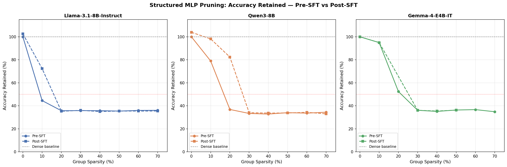

Normalised against each model's own dense baseline:

| Model | sp | Pre-SFT Retained | Post-SFT Retained | Uplift |
|---|---|---|---|---|
| Qwen3 | 10% | 79.0% | **98.2%** | +19.2pp |
| Qwen3 | 20% | 36.8% | **82.4%** | +45.6pp |
| Llama | 10% | 44.5% | **72.3%** | +27.7pp |
| Gemma-4 | 10% | 94.9% | **95.0%** | +0.1pp |

SFT turns Qwen3 at sp=10 into a near-lossless pruned model (98.2% retained) and at sp=20 into a highly viable one (82.4% retained). For Llama at sp=10, the recovery brings the model from practically unusable (44.5% retained) to substantially functional (72.3% retained). Gemma-4 at sp=10 needs no SFT — it already retains 94.9%.

---

### 8. Accuracy vs Inference CO₂ (Pareto View)

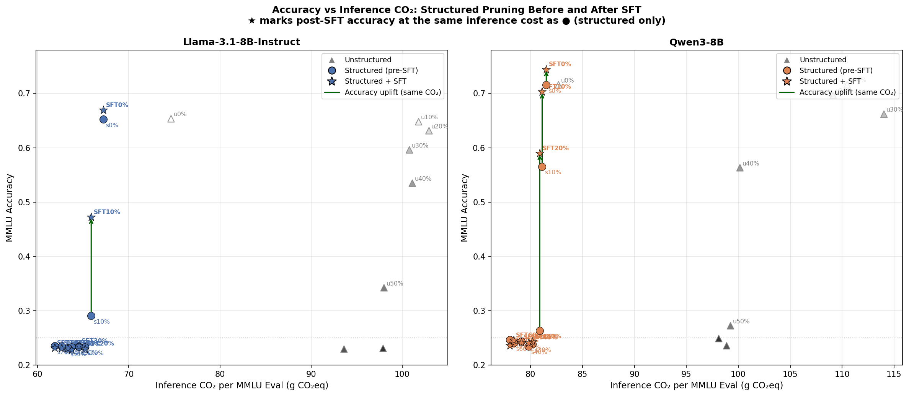

This plot shows the **efficiency frontier** — accuracy (y-axis) vs inference CO₂ per MMLU evaluation (x-axis). Lower-right is worse (high cost, low accuracy); upper-left is better (low cost, high accuracy).

**Key observations:**

- **Unstructured pruning (triangles)** traces a diagonal from upper-right (dense, high accuracy, higher CO₂) to lower-right (high sparsity, low accuracy, slightly lower CO₂). It never moves left — unstructured pruning does not reduce inference FLOPs.
- **Structured pre-SFT (circles)** moves sharply left (lower CO₂, 35% savings) but also sharply down (collapsed accuracy). This is a bad trade — you get less of everything except a green CO₂ number.
- **Structured + SFT (stars)** is at the same x-position as the pre-SFT circles (identical inference CO₂) but dramatically higher on the y-axis. **The vertical arrows show pure accuracy uplift at zero inference CO₂ cost.**

For **Qwen3 at sp=10 and sp=20**, the post-SFT stars sit in the upper-left region — lower CO₂ than most unstructured points AND higher accuracy than several of them. This is the only Pareto-dominant region in the entire plot.

---

### 9. CO₂ Breakdown: Inference vs SFT Training

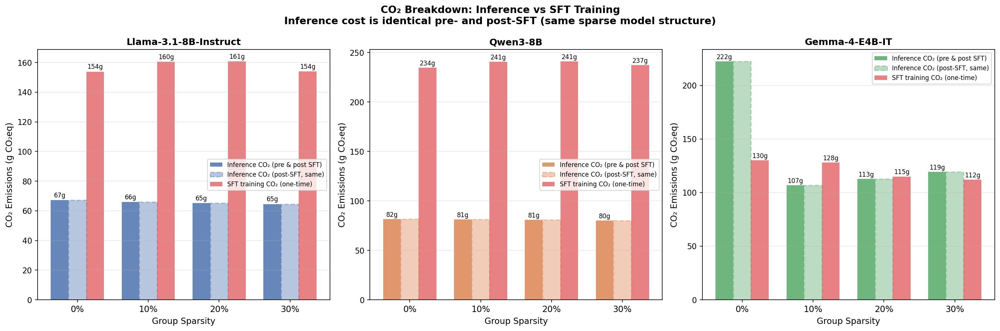

This chart separates inference CO₂ (ongoing, per deployment eval) from SFT training CO₂ (one-time overhead):

| Model | Inference CO₂ (per run) | SFT Training CO₂ (one-time) | Break-even runs |
|---|---|---|---|
| Llama | ~65 g (saved 35 g vs unstruct) | ~155–202 g | **5–6 runs** |
| Qwen3 | ~80 g (saved 28 g vs unstruct) | ~235–241 g | **9 runs** |
| Gemma-4 | ~105 g (normalised, saved ~62 g vs sp=0 unstr) | ~115–170 g | **3–4 runs** |

**After break-even, every subsequent inference run delivers net CO₂ savings vs the unstructured equivalent.** For a production model serving thousands of requests, the one-time SFT training cost becomes negligible within minutes of deployment.

> Inference CO₂ for post-SFT equals pre-SFT structured (same sparse model, same FLOPs). The right-side bar (training CO₂) is incurred once at fine-tuning time and not repeated.

---

### 10. Dashboard

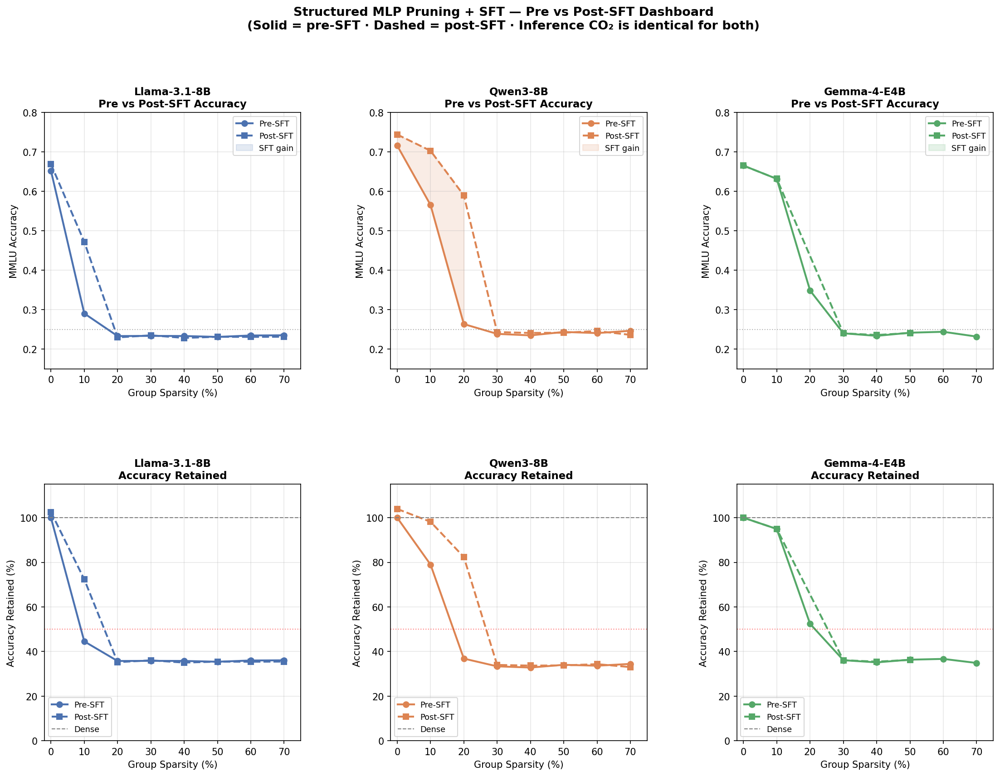

Combined view across all three models and both sparsity dimensions (accuracy and accuracy retained). The shaded region on each accuracy panel marks where SFT gains exceed 2pp — visible for Qwen3 at sp=10 and sp=20, and for Llama at sp=10.

---

## 11. Consolidated Findings

### What SFT fixes

| Finding | Model | Evidence |
|---|---|---|
| Qwen3 sp=10 recovers to 98.2% retained (+13.7pp) | Qwen3 | §6, §7 |
| Qwen3 sp=20 recovers from random to 82.4% retained (+32.6pp) | Qwen3 | §6, §7 |
| Llama sp=10 recovers from 44.5% to 72.3% retained (+18.2pp) | Llama | §6, §7 |
| Inference CO₂ is identical pre/post SFT (same sparse structure) | All | §8, §9 |
| Structured+SFT is Pareto-dominant over unstructured for Qwen3 | Qwen3 | §8 |
| SFT training cost is recouped in 5–9 inference runs | All | §9 |

### What SFT cannot fix

| Finding | Model | Evidence |
|---|---|---|
| Gemma-4 SFT provides negligible accuracy uplift at all sparsities | Gemma-4 | §6 |
| Llama/Qwen3 at sp≥30: SFT cannot recover from full collapse | All | §6 |
| SFT does not change the pruning mask → CO₂ savings do not improve | All | §8 |

### Practical recommendations

1. **Qwen3 sp=10 + SFT is the best overall operating point**: 98.2% accuracy retained at 26.6% lower inference CO₂ vs unstructured. Use this when accuracy must stay near-baseline and carbon matters.
2. **Qwen3 sp=20 + SFT** is viable for larger CO₂ savings (25.9%) at 82.4% accuracy retained — useful when a ~17pp accuracy trade is acceptable.
3. **Llama sp=10 + SFT** is functional (72.3% retained) at 35.3% lower CO₂ — a larger accuracy compromise but larger CO₂ savings than Qwen3.
4. **Gemma-4: stay at sp=10 without SFT** (94.9% retained, no SFT needed). Do not go to sp=20 — collapse is unrecoverable.
5. **Never prune past sp=20 for structured + SFT** — sp=30+ destroys all three models beyond SFT recovery.
6. **SFT training carbon is amortised quickly** — break-even at 5–9 inference runs. Any production deployment that serves more than ~10 MMLU-scale evaluations pays back the SFT training cost in CO₂ savings.

---

## Part III — All Models: Semi-Structured 2:4 + SFT vs Pre-SFT

These plots use the available global-magnitude semi-structured 2:4 SFT runs for Llama, Qwen3, and Gemma-4. Semi-structured 4:8 and unstructured SFT plots are not included because matching post-SFT run artifacts are not present in `outputs/sft_runs/`.

### 12. Semi-Structured 2:4 Accuracy Recovery

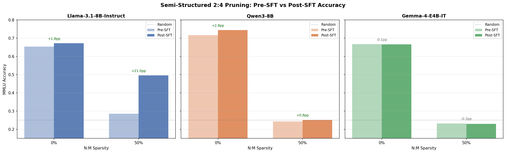

### 13. Semi-Structured 2:4 Accuracy Retained

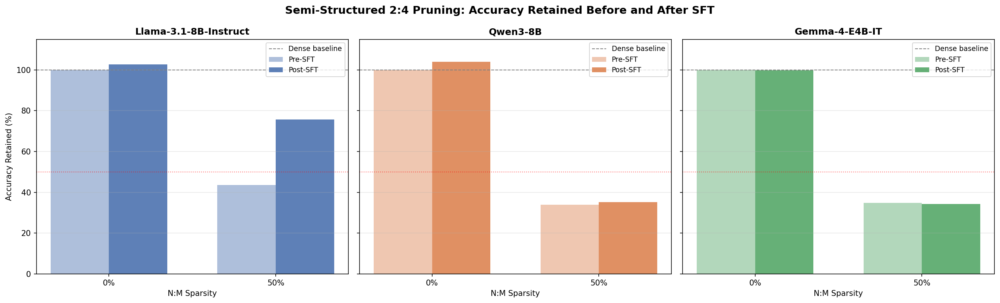

---

## Reproducibility

```bash
# Regenerate all plots in this report
python scripts/plot_sft_comparison.py

# Output directories:
#   outputs/plots/gemma4_structured/   ← Gemma-4 structured pre-SFT plots
#   outputs/plots/sft_comparison/      ← structured and semi-2:4 SFT comparison plots (all models)
```

Run directories:

| Experiment | Run directory |
|---|---|
| Gemma-4 structured (pre-SFT) | `outputs/runs/mmlu_pruning_ce32d7e86e8a/gemma4_e4b_it/` |
| Gemma-4 unstructured (CO₂ ref) | `outputs/runs/mmlu_pruning_39fc35ec1838/gemma4_e4b_it/` |
| Llama structured (pre-SFT) | `outputs/runs/mmlu_pruning_bd584ae1ae1c/llama31_8b_instruct/` |
| Llama structured + SFT (sp=0–30) | `outputs/sft_runs/structured_sft_97c7151924e1/llama31_8b_instruct/` |
| Llama structured + SFT (sp=40–70) | `outputs/runs/structured_sft_9db8cf7ef319/llama31_8b_instruct/` |
| Qwen3 structured (pre-SFT) | `outputs/runs/mmlu_pruning_bd584ae1ae1c/qwen3_8b/` |
| Qwen3 structured + SFT | `outputs/runs/structured_sft_23d578f0d9f2/qwen3_8b/` |
| Gemma-4 structured + SFT (sp=0,10,40,50) | `outputs/sft_runs/structured_sft_b9ca5a313b42/gemma4_e4b_it/` |
| Gemma-4 structured + SFT (sp=20,30) | `outputs/sft_runs/structured_sft_df37aaf51b99/gemma4_e4b_it/` |
